# Mailing List API Web Go/MySQL/Templates/Bootstrap 
## Solução que utiliza usuários/email como exemplo para interação entre o cliente e o servidor através de templates nativos do Go, sendo altamente performáticos e intuitívos.

<p align="center">
  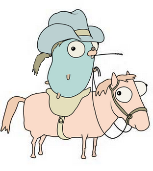
</p>


A aplicação foi escrita totalmente em Go 🐹, visando utilizar o mínimo de dependências possíveis, tratar a maioria dos erros com os devidos cuidados e documentada com comentários de fácil entendimento

Pacotes utilizados

- Gorilla/Mux 🦍
- GORM
- Bootstrap


## Features

- Na aplicação é possível ver os usuários já adicionados previamente
- Adicionar novos usuários
- Ver usuários específicos
- Excluir algum usuário desejado
- Atualizar as informações


## Na prática


Iniciando a aplicação

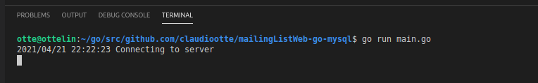


Acessando os usuários já inseridos

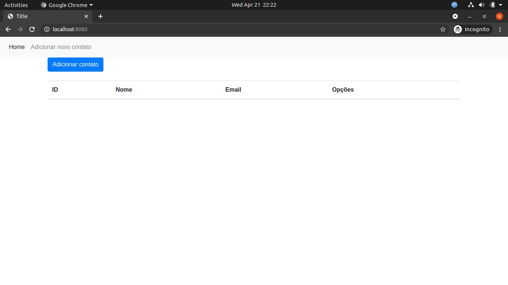


Adicionando novos usuários

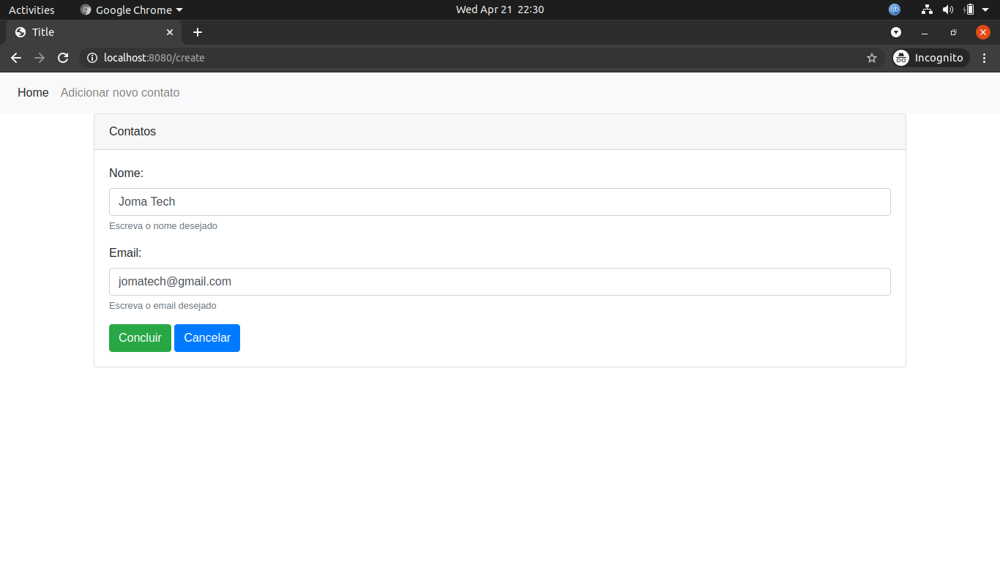

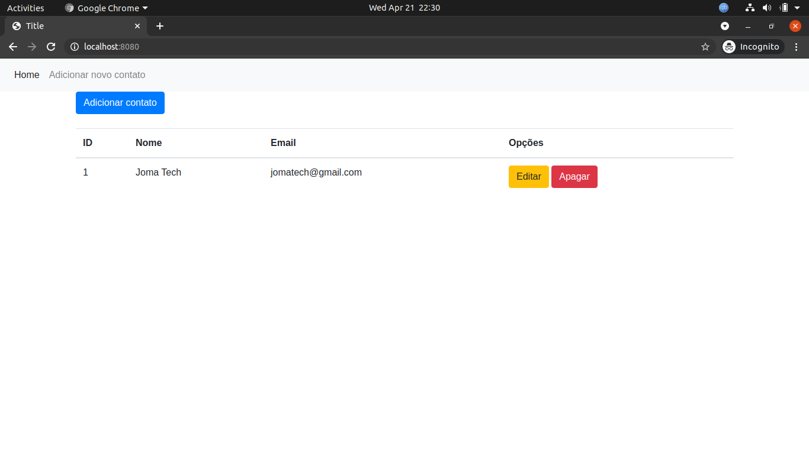

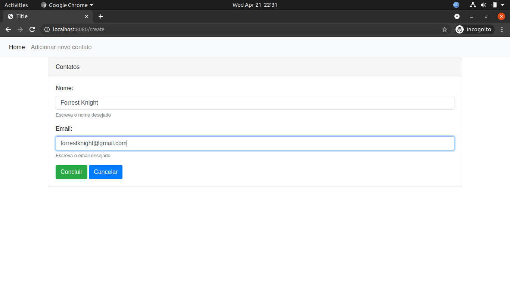

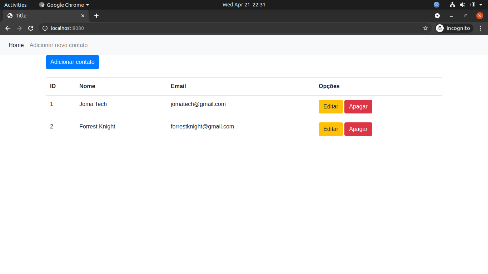


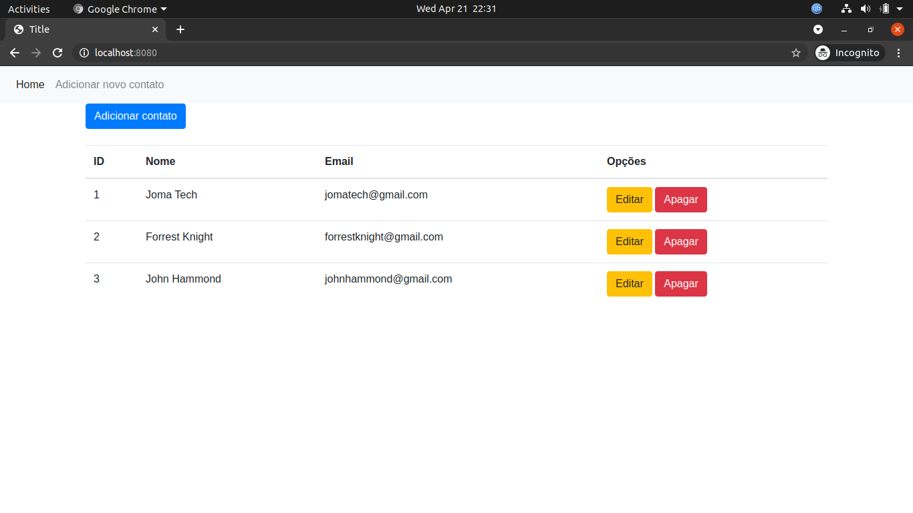

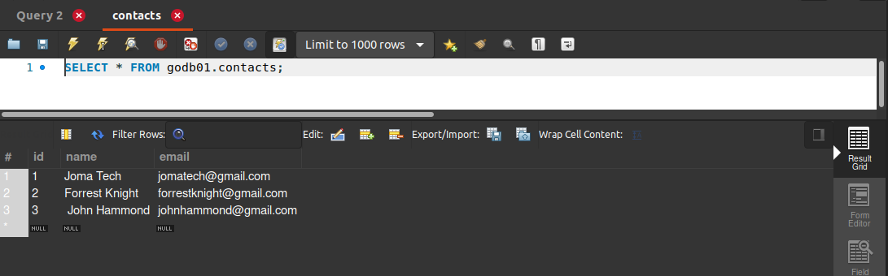


Atualizando o usuário desejado

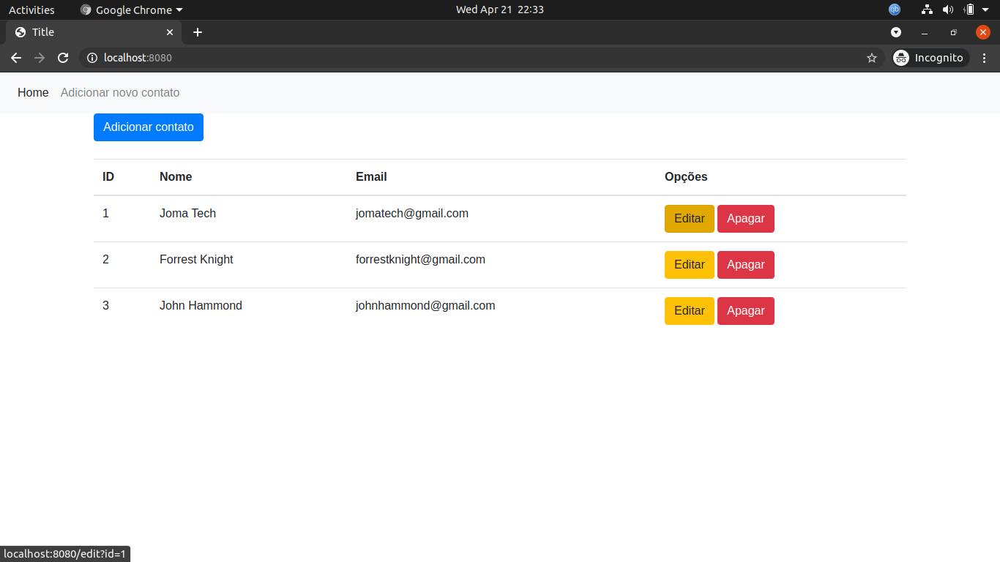

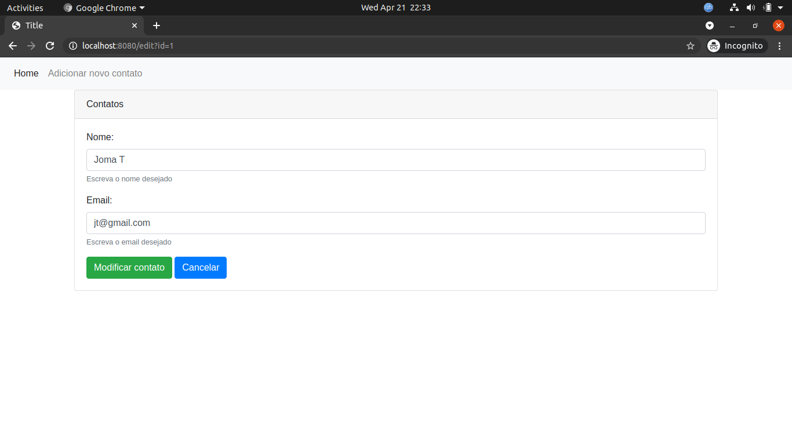

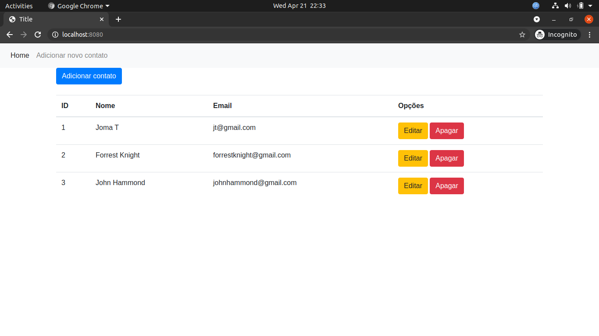

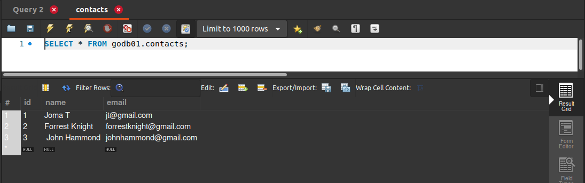


Deletando o usuário desejado


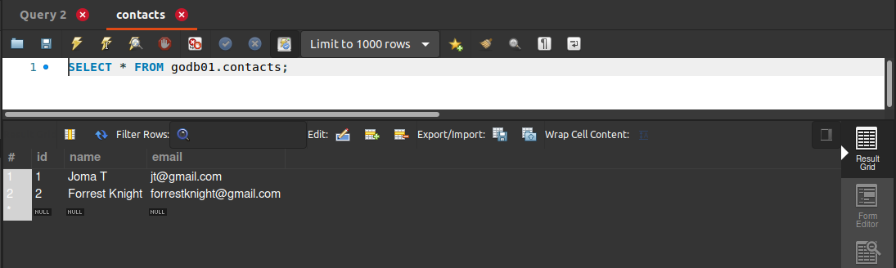


## Requisitos

```sh
Golang: https://golang.org/dl/
MySQL instalado e configurado com as configurações desejadas (editar no arquivo credentials.go)
API Client de sua preferência (O que aparece nas imagens se chama Postman)

Após ter instalado o go
Gorilla mux: go get -u github.com/gorilla/mux
GORM: go get -u gorm.io/gorm
```


## Utilização

Basta utilizar o comando go build e aproveitar o aplicativo! 😊
